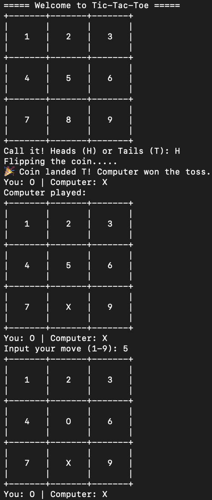

## Tic-Tac-Toe (Python)


A simple terminal-based Tic-Tac-Toe game in Python where you can play against the computer.

### Features
- Player vs Computer mode
- Random toss to decide who goes first
- Automatic board display
- Win and draw detection
- Replay option after each game

## Screenshot / Demo

Here’s how the game looks in the terminal:




### Installation

1. Make sure Python 3.8+ is installed.
2. Clone the repo
   ```sh
   git clone https://github.com/gihan_sandakelum/tic-tac-toe.git
   ```
3. Go to the directory and execute
   ```sh
   cd tic-tac-toe
   python tictactoe.py
   ```

### How to Play


- Enter a number from 1 to 9 to place your symbol on the board.
- Board positions:

1 | 2 | 3
---------
4 | 5 | 6
---------
7 | 8 | 9

- Align three of your symbols vertically, horizontally, or diagonally to win.
- If all positions are filled and no one wins, the game ends in a draw.
- After each game, you can choose to play again.


## License

Distributed under the MIT License. See `LICENSE` for more information.